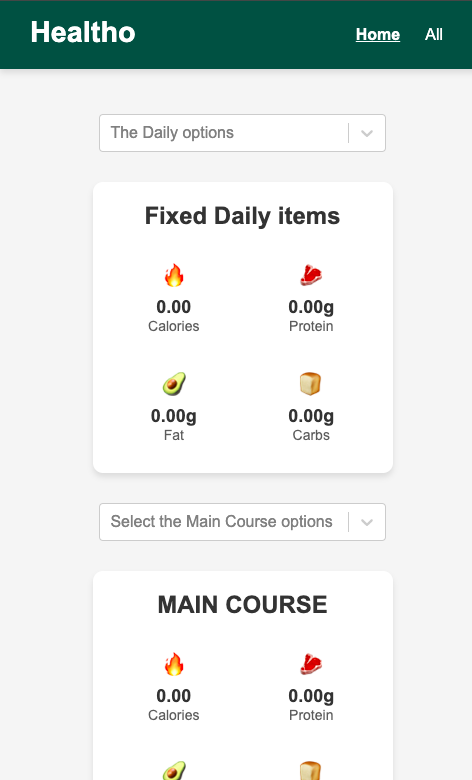

# **Nutrient Calculator App**

Welcome to the Nutrient Calculator App, a React-based application that helps users calculate the nutrients of their meals based on the ingredients they select.

## **Overview**

This application allows users to select ingredients and calculates the total nutrients, including calories, protein, fat, and carbohydrates, of their meal. The app provides a user-friendly interface, making it easy for users to input their ingredients and get instant results.

## **Features**

* **Ingredient Selection** : Users can select from a variety of ingredients, including fruits, vegetables, meats, and grains.
* **Nutrient Calculation** : The app calculates the total nutrients of the selected ingredients, including calories, protein, fat, and carbohydrates.
* **Meal Planning** : Users can plan their meals in advance and save their selections for future reference.
* **Easy Navigation** : The app features a simple and intuitive navigation system, making it easy for users to move between different sections.

## **Technical Details**

* **Frontend** : The app is built using React, a popular JavaScript library for building user interfaces.
* **Routing** : The app uses React Router for client-side routing, allowing users to navigate between different sections of the app.
* **State Management** : The app uses the `useState` hook to manage state and update the nutrient calculations in real-time.

## **Components**

* **App.js** : The main application component that sets up the routing configuration and renders the layout.
* **Home.js** : The component that renders the home page, where users can select ingredients and view their nutrient calculations.
* **All.js** : The component that renders the all ingredients page, where users can view a list of all available ingredients.
* **Layout.js** : The component that provides a common layout for both the home and all ingredients pages.
* **Card.js** : A reusable component that displays individual ingredients and their corresponding nutrient information.
* **Navbar.js** : A reusable component that provides navigation links to different sections of the app.

## **Screenshots:**

### PC design:

### Mobile version:

## **Getting Started**

To run the application, follow these steps:

1. Clone the repository to your local machine.
2. Install the dependencies by running `npm install` or `yarn install`.
3. Start the development server by running `npm start` or `yarn start`.
4. Open your web browser and navigate to `http://localhost:3000` to see the application in action.

### **License**

This project is licensed under the MIT License. See the `LICENSE` file for details.

### **Contributing**

Contributions are welcome! If you'd like to contribute to this project, please fork the repository and submit a pull request with your changes.

### **Future Development**

Future development plans include:

* Adding more ingredients to the database
* Implementing a search function for ingredients
* Allowing users to save and load their meal plans
* Integrating with popular health and fitness APIs to provide more detailed nutrient information

Thank you for using the Nutrient Calculator App!
